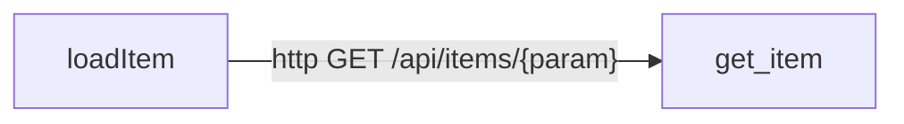

# ARCHITECTURE — openapi_codegen_sample

> System-level **cross-boundary** view: client/handler routes, dependency injection, and data stores.
> **Not one of the five contract artifacts** — a regenerated human-validation surface (DEC-090), like `forensic visualize` / `serve --ui`. Use it to sanity-check the graph: a wrong edge here is a wrong edge everywhere.
> **Confidence:** facts are `EXTRACTED` (deterministic from AST and git) unless a section / line says otherwise (DEC-015).

## Cross-boundary architecture

**Legend.** Edge style encodes confidence (DEC-015): solid = `EXTRACTED`, dashed = `INFERRED`, dotted = `AMBIGUOUS`. `[(cylinder)]` nodes are database tables. Edge kinds: `ROUTES_TO` (labelled with the endpoint — a frontend/client call joined to its backend handler), `injects` (DI binding), `persists` (ORM model → table).

---

*Generated by forensic-deepdive 0.7.0 on 2026-05-23. Regenerate with `forensic update` — do not hand-edit.*
